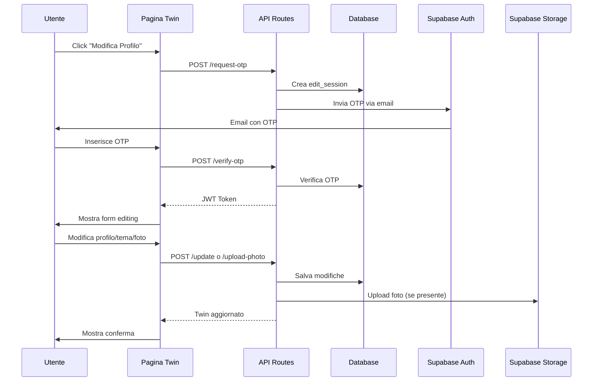

# Twin Profile Edit System - Implementation Guide

## 🎉 Implementazione Completata!

Il sistema di modifica profilo Twin è stato completamente implementato secondo il piano. Questa guida ti aiuterà a configurare e testare la funzionalità.

---

## 📋 Checklist di Setup

### 1. Database Setup

Esegui lo script SQL per aggiornare il database:

```bash
# Connettiti al tuo database Supabase e esegui:
psql -h <your-supabase-host> -U postgres -d postgres -f database-updates.sql
```

Oppure copia il contenuto di `database-updates.sql` nella SQL Editor di Supabase Dashboard.

### 2. Supabase Storage Setup

Nel Supabase Dashboard, vai su **Storage** e crea il bucket:

1. Click "Create Bucket"
2. Nome: `twin-profile-photos`
3. Seleziona "Public bucket"
4. Crea le policies seguenti nella sezione Storage Policies:

```sql
-- Policy per upload
CREATE POLICY "Allow upload profile photos"
ON storage.objects FOR INSERT
WITH CHECK (bucket_id = 'twin-profile-photos');

-- Policy per download pubblico
CREATE POLICY "Public photos are downloadable"
ON storage.objects FOR SELECT
USING (bucket_id = 'twin-profile-photos');

-- Policy per aggiornamento
CREATE POLICY "Allow update profile photos"
ON storage.objects FOR UPDATE
USING (bucket_id = 'twin-profile-photos');

-- Policy per eliminazione
CREATE POLICY "Allow delete profile photos"
ON storage.objects FOR DELETE
USING (bucket_id = 'twin-profile-photos');
```

### 3. Environment Variables

Aggiungi al tuo `.env.local`:

```bash
# Existing variables
NEXT_PUBLIC_SUPABASE_URL=your_supabase_url
NEXT_PUBLIC_SUPABASE_ANON_KEY=your_supabase_anon_key
SUPABASE_SERVICE_ROLE_KEY=your_service_role_key
OPENAI_API_KEY=your_openai_api_key

# NEW - Required for JWT tokens
JWT_SECRET_KEY=your_random_secret_key_here_min_32_chars
```

**Genera una chiave sicura per JWT_SECRET_KEY:**

```bash
node -e "console.log(require('crypto').randomBytes(32).toString('hex'))"
```

### 4. Dependencies

Le dipendenze necessarie sono già state installate:

```json
{
  "jsonwebtoken": "^9.0.2",
  "@types/jsonwebtoken": "^9.0.5"
}
```

---

## 🚀 Come Usare

### Per gli Utenti

1. **Visita la tua pagina Twin** (es. `/t/mario-rossi`)
2. Se il profilo ha un'email associata, vedrai il bottone **"Modifica Profilo"**
3. Click sul bottone e segui il flusso:
   - Conferma la tua email
   - Ricevi il codice OTP a 6 cifre via email
   - Inserisci il codice OTP
   - Accedi all'interfaccia di editing

### Funzionalità Disponibili

#### 1. Modifica Sezioni Profilo

Sei sezioni editabili tramite tab:

- **Identità**: Chi sei e cosa fai
- **Pensiero**: Come ragioni e affronti i problemi
- **Metodologia**: Come lavori e quali strumenti usi
- **Limiti**: I tuoi principi e vincoli
- **Risultati**: I tuoi successi e progetti
- **Stile**: Come comunichi

Per ogni sezione puoi:

- ✏️ Modificare direttamente il testo
- ✨ Generare domande GPT per approfondire
- 🎤 Usare la modalità vocale con AI

#### 2. Cambio Tema

Scegli tra 10 temi visuali:

- Cosmic (default)
- Ocean
- Sunset
- Forest
- Aurora
- Galaxy
- Neon
- Lavender
- Ember
- Midnight

#### 3. Upload Foto Profilo

- Drag & drop o click per caricare
- Formati: JPG, PNG
- Dimensione max: 5MB
- Auto-ridimensionamento a 500x500px

---

## 🔐 Sicurezza

### OTP (One-Time Password)

- Codice a 6 cifre
- Valido per 15 minuti
- Rate limiting: max 3 richieste ogni 10 minuti

### JWT Token

- Valido per 1 ora
- Firmato con chiave segreta (JWT_SECRET_KEY)
- Verifica lato server per ogni operazione

### Validazioni

- Email verificata tramite OTP
- File upload: tipo e dimensione controllati
- Input sanitizzati prima del salvataggio
- Token verificati per ogni API call

---

## 📁 Struttura File Creati

### API Routes

```
app/api/twins/edit/
├── request-otp/route.ts      # Richiesta OTP via email
├── verify-otp/route.ts        # Verifica OTP e genera token
├── update/route.ts            # Aggiorna profilo
├── upload-photo/route.ts      # Upload foto profilo
├── generate-questions/route.ts # Genera domande GPT
└── voice-update/route.ts      # Estrazione da conversazione vocale
```

### Componenti

```
components/
├── edit-twin-button.tsx       # Bottone e orchestrazione flusso
├── edit-twin-dialog.tsx       # Dialog iniziale richiesta OTP
├── otp-verification.tsx       # Form verifica OTP a 6 cifre
├── edit-profile-form.tsx      # Form principale con tab
├── edit-profile-voice.tsx     # Modalità editing vocale
├── theme-selector.tsx         # Selettore visuale temi
└── photo-upload.tsx           # Upload e preview foto
```

### Librerie

```
lib/
├── auth.ts                    # Utility verifica JWT token
├── types.ts                   # Types aggiornati con editing
└── prompts.ts                 # Prompts aggiornati per editing
```

### Database

```
database-updates.sql           # Script SQL per aggiornamenti DB
```

---

## 🧪 Testing

### Test Manuale Consigliato

1. **Creazione Twin con Email**

   ```
   - Crea un nuovo twin con email valida
   - Verifica che il twin sia salvato correttamente
   ```

2. **Flusso OTP**

   ```
   - Click "Modifica Profilo"
   - Inserisci email corretta → ricevi OTP
   - Inserisci OTP corretto → accedi all'editing
   - Prova OTP sbagliato → mostra errore
   - Attendi scadenza (15 min) → mostra errore
   ```

3. **Modifica Sezioni via Form**

   ```
   - Modifica ogni sezione del profilo
   - Genera domande GPT per una sezione
   - Salva modifiche → verifica aggiornamento
   ```

4. **Modifica via Voce**

   ```
   - Click "Modifica con Voce" su una sezione
   - Parla con l'AI
   - Stop conversazione → estrazione e salvataggio
   ```

5. **Cambio Tema**

   ```
   - Seleziona diversi temi
   - Salva → verifica cambio sfondo pagina
   ```

6. **Upload Foto**

   ```
   - Upload JPG valido → successo
   - Upload file troppo grande → errore
   - Upload formato sbagliato → errore
   - Verifica foto mostrata nella pagina
   ```

7. **Edge Cases**
   ```
   - Twin senza email → bottone non visibile
   - Token scaduto → richiedi nuovo OTP
   - Rate limiting → troppi tentativi
   ```

---

## 🐛 Troubleshooting

### OTP non arriva via email

**Problema**: Supabase Auth potrebbe non essere configurato per inviare email.

**Soluzione**:

1. Vai su Supabase Dashboard → Authentication → Email Templates
2. Configura SMTP o usa il provider di default
3. Verifica che l'email sia abilitata nelle impostazioni Auth

**Alternativa**: Per testing locale, puoi controllare i log del database:

```sql
SELECT * FROM twin_edit_sessions ORDER BY created_at DESC LIMIT 1;
```

E prendere manualmente il codice OTP.

### Token JWT non valido

**Problema**: JWT_SECRET_KEY non configurata o diversa.

**Soluzione**:

- Verifica che `JWT_SECRET_KEY` sia nel `.env.local`
- Usa la stessa chiave in tutti gli ambienti
- Rigenera una nuova chiave sicura

### Storage bucket non trovato

**Problema**: Bucket `twin-profile-photos` non creato in Supabase.

**Soluzione**:

1. Vai su Supabase Dashboard → Storage
2. Crea il bucket manualmente
3. Imposta come pubblico
4. Aggiungi le policies

### Errori di tipo TypeScript

**Problema**: Import di `ThemeName` potrebbe causare errori.

**Soluzione**:

```typescript
// In lib/types.ts, importa ThemeName da themes
import type { ThemeName } from "./themes";
```

---

## 🔄 Flusso Completo



---

## 📊 Database Schema Aggiunto

### Tabella: `twin_edit_sessions`

```sql
CREATE TABLE twin_edit_sessions (
  id UUID PRIMARY KEY,
  twin_id UUID REFERENCES twins(id),
  email TEXT,
  otp_token TEXT,              -- Codice a 6 cifre
  verified BOOLEAN,
  created_at TIMESTAMPTZ,
  expires_at TIMESTAMPTZ,      -- created_at + 15 minuti
  verified_at TIMESTAMPTZ
);
```

### Colonna aggiunta: `twins.profile_photo_url`

```sql
ALTER TABLE twins ADD COLUMN profile_photo_url TEXT;
```

---

## 🎯 Prossimi Passi Suggeriti

1. **Testing in produzione**: Testa il flusso completo con utenti reali
2. **Monitoring**: Aggiungi logging per tracciare richieste OTP e errori
3. **Email Template**: Personalizza il template email OTP in Supabase
4. **Analytics**: Traccia quante persone modificano i loro profili
5. **Backup**: Sistema di backup automatico prima delle modifiche
6. **History**: Tabella per storico modifiche profilo (optional)

---

## 💡 Note Aggiuntive

- **Modalità Voice**: Richiede OpenAI Realtime API attiva
- **Storage**: Le foto vecchie non vengono eliminate automaticamente (da implementare cleanup)
- **Caching**: Dopo il salvataggio, `router.refresh()` ricarica i dati
- **Session Storage**: Token temporaneo salvato in `sessionStorage` per chiamate API

---

## 📞 Supporto

Se incontri problemi:

1. Controlla i log del browser (Console)
2. Controlla i log di Supabase (Dashboard → Logs)
3. Verifica che tutte le variabili d'ambiente siano configurate
4. Controlla che il database sia aggiornato con lo script SQL

---

**Implementazione completata! 🎉**

Tutti i 15 todo items sono stati completati con successo. Il sistema è pronto per l'uso!
